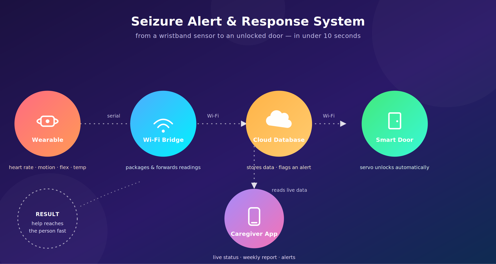

# Alert System for Epileptic Seizures

A wearable seizure-detection and emergency-response system: a sensor-equipped wristband detects the physical signs of a seizure, sounds a local alert, logs data to the cloud, and automatically unlocks a door so a caregiver can reach the person quickly.

## How it works

1. **STM32 "Blue Pill"** reads temperature/humidity (DHT11), muscle movement (flex sensor), heart rate (pulse sensor), and motion/posture (ADXL345 accelerometer). It shows live readings on a 16x2 LCD and sounds a local buzzer/APR9600 voice alert when a seizure is detected (flex sensor reads `0`).
2. Every reading is packed into a compact string, e.g. `t30h33r60f0a1` (temperature `30`, humidity `33`, heart rate `60`, flex `0`, posture code `1` = sitting), and sent over serial to the **ESP-01**.
3. The **ESP-01** parses that string, timestamps it, and pushes it to **Firebase Realtime Database**. If the flex reading indicates a seizure (`flex == 0`), it also sets `Door` to `"Open"` in Firebase.
4. The **NodeMCU** polls the `Door` value in Firebase every ~2 seconds and drives a servo motor to physically unlock the door when it sees `"Open"`.
5. A companion mobile app (built with a low-code app builder) reads the same Firebase data to show live sensor values, a weekly health report, and recommendations to caregivers.

## Repository structure

```
firmware/
├── stm32_wearable_device/     # Main sensor + LCD + local-alert firmware (STM32)
│   ├── epileptic.ino
│   ├── dht.h
│   └── dht.cpp
├── esp01_firebase_relay/      # Parses STM32 data, pushes to Firebase, flags door open
│   └── esp01_code.ino
└── nodemcu_door_unlock/       # Polls Firebase, drives the door servo
    └── door_code.ino

archive/                       # Earlier prototypes / reference code, not part of the final build
├── stm32_gps_prototype.ino    # Early draft that explored GPS + gas-sensor input (dropped)
└── esp8266_webserver_reference.ino  # Generic AT-command webserver example (not Firebase-based)

docs/
└── images/
    └── system_blueprint.svg / .png   # Architecture diagram
```

## Hardware used

| Component | Role |
|---|---|
| STM32F103C8 ("Blue Pill") | Central MCU for the wearable device |
| ESP8266 ESP-01 | WiFi bridge from wearable → Firebase |
| NodeMCU (ESP8266) | WiFi client that drives the door servo |
| ADXL345 | Accelerometer — detects falls/posture during a seizure |
| Flex sensor | Detects abnormal muscle contraction |
| Heart-rate pulse sensor | Detects abnormal heart rate during a seizure |
| DHT11 | Ambient temperature & humidity |
| APR9600 voice module + speaker | Local audible alert |
| 16x2 LCD | On-device status display |
| Tower Pro SG90 servo | Drives the door lock mechanism |

## Software / cloud

- **Arduino IDE** (Embedded C/C++) for all three microcontrollers
- **Google Firebase Realtime Database** for cloud storage and messaging between the ESP-01 and NodeMCU
- A low-code mobile app builder for the companion app (fingerprint auth, live data, weekly report)

## Setup

1. Install the Arduino IDE and the board packages for STM32 and ESP8266.
2. Install libraries: `ESP8266Firebase`, `ESP8266WiFi`, `NTPClient`, `WiFiUdp`, `Servo`, `LiquidCrystal`, `Adafruit_Sensor`, `Adafruit_ADXL345_U`.
3. Create a Firebase project → Realtime Database → set `.read` and `.write` rules to `true` for testing (tighten these before any real/public deployment).
4. In `esp01_firebase_relay/esp01_code.ino` and `nodemcu_door_unlock/door_code.ino`, replace the placeholder values near the top of each file with your own:
   ```cpp
   #define WIFI_SSID     "YOUR_WIFI_SSID"
   #define WIFI_PASSWORD "YOUR_WIFI_PASSWORD"
   #define FIREBASE_REFERENCE_URL "https://YOUR_PROJECT-default-rtdb.firebaseio.com/"
   ```
5. Flash `stm32_wearable_device/epileptic.ino` to the Blue Pill, `esp01_firebase_relay/esp01_code.ino` to the ESP-01, and `nodemcu_door_unlock/door_code.ino` to the NodeMCU.

   ## System blueprint




## Results (from testing)

- Seizure detection sensitivity threshold: 95%
- Door-unlock response time: within 10 seconds, failure rate < 0.1%
- Alert response time to companion app: under 5 seconds

## Future scope

Extending the platform beyond epilepsy to other conditions with similar monitoring needs — cardiac arrhythmias, sleep disorders, diabetic emergencies — using the same sensor-to-cloud-to-actuator pipeline.

## License
K.Priyadarshini
Osmania University 

